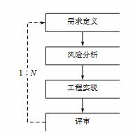

# 项目开发计划书

[TOC]
##目标  
>开发一个基于C语言的JS引擎。    

##总则  
>制定项目开发规范的目的是为项目开发人员开发过程更加高效，有计划性，稳步推进项目的前进。 

##生存周期划分  
>一个软件从定义、开发、使用和维护，直至最终被废去的过程，叫软件生存周期。本项目采用的开发周期模型为“螺旋模型”。它尤其重视风险分析阶段，特别适用于庞大并且复杂，非常高风险的项目。这种模型的每一个周期都包括需求定义、风险分析、工程实现和评审4个阶段，由这4个阶段进行迭代。软件开发过程每迭代一次，软件开发又前进一个层次。  

  

##开发平台  
* 系统：Linux（Ubuntu）
* IDE：Qtcreator
* 语言：C/C++
##Spider Monkey简介
>SpiderMonkey是Mozilla项目的一部分，是一个用C语言实现的JavaScript脚本引擎。  

###三个核心概念  
* 运行时环境：运行时环境是所有 JavaScript 变量，对象，脚本以及代码的上下文所存在的空间。每一个上下文对象，以及所有的对象均存在于此。一般应用仅需要一个运行时即可。  
* 上下文：上下文即脚本执行的环境，在 SpiderMonkey 中，上下文可以编译执行脚本，可以存取对象的属性，调用 JavaScript 的函数，转换类型，创建 / 维护对象等。几乎所有的 SpiderMonkey 函数都需要上下文作为其第一个参数 (JSContext )。  
* 全局对象：全局对象包含 JavaScript 代码所用到的所有类，函数，变量。  
上下文与线程密不可分，一般来讲，单线程应用可以使用一个上下文来完成所有的操作，每一个上下文每次只能完成一个操作，所有在多线程应用中，同一时刻只能有一个线程来使用上下文对象。一般而言，多线程应用中，每个线程对应一个上下文。
###JS引擎的API函数种类  
* 数据类型操作  
* 运行时控制  
* 类和对象创生的维护  
* 函数和脚本执行  
* 字符串处理  
* 错误处理  
* 安全性控制  
* 调试支持  
##项目安排  
###Spider Monkey的学习
* 编译
* 基本调用
* JS相关知识（开发中学习）
##考核方式
* 学习资料  
* 进度汇报
* 代码整理
* 知识分享
以上资料上传github  https://github.com/YangWeiBin/OurProject.git 每周更新